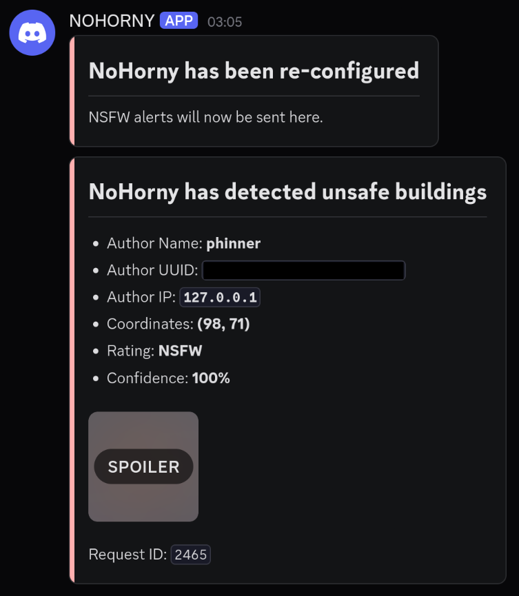

# NoHorny

[](https://maven.xpdustry.com/#/releases/com/xpdustry/nohorny-client)
[](https://github.com/xpdustry/nohorny/releases)
[](https://github.com/Anuken/Mindustry/releases)
[](https://discord.xpdustry.com)

## Description

Are you sick of players turning your awesome server into a NSFW gallery?
Do you wish to bring back your logic displays without the fear of seing anime girls in questionable positions?
Well, worry no more, xpdustry cooked another plugin just for this situation.

Introducing **NoHorny**, the successor of [BMI](https://github.com/L0615T1C5-216AC-9437/BannedMindustryImage).
This project consists of a Mindustry plugin client that automatically tracks logic displays and canvases,
and a standalone classification server that processes them, for automatic NSFW moderation.

Enjoy this family friendly factory building game as the [cat](https://github.com/Anuken) intended it to be.

## Client (Mindustry Plugin)

### Installation

This plugin requires at least:

- Mindustry 159
- Java 25
- [SLF4MD](https://github.com/xpdustry/slf4md) latest (optional)

Put [`nohorny-client.jar`](https://github.com/xpdustry/nohorny/releases/latest) (and [`slf4md.jar`](https://github.com/xpdustry/slf4md/releases/latest) if needed) in your `config/mods` directory and start your mindustry server.

Now, players placing unsafe buildings will be automatically banned.
Then the buildings will be deleted and refunded to the player's team.

### Configuration

You can configure NoHorny using the Mindustry built-in `config` command in your server console, with `config key value`.

#### Available settings

| Key                             | Description                                                                                                                                         | Default Value                      |
|---------------------------------|-----------------------------------------------------------------------------------------------------------------------------------------------------|------------------------------------|
| `nohorny-auto-mod-policy`       | The policy to apply when a group of buildings is classified.                                                                                        | `BAN_NSFW`                         |
| `nohorny-api-endpoint`          | Base URL used by the plugin. The client resolves `status` and `classify` relative to it.                                                            | `https://nohorny.xpdustry.com/api` |
| `nohorny-api-auth-type`         | HTTP auth mode for the API. Valid values: `DISABLED`, `BASIC`, `BEARER`.                                                                            | `DISABLED`                         |
| `nohorny-api-auth-value`        | Auth payload. For `BASIC`, use `username:password`. For `BEARER`, use the raw token.                                                                | empty                              |
| `nohorny-discord-webhook`       | Discord webhook used to report unsafe buildings.                                                                                                    | empty                              |
| `nohorny-discord-webhook-name`  | Username used for messages sent through the Discord webhook.                                                                                        | `NoHorny`                          |
| `nohorny-discord-webhook-proxy` | Whether discord requests should be proxied. Useful if discord is banned in the country. Uses [ProxyScrape](https://proxyscrape.com/free-proxy-list) | `false`                            |
| `nohorny-debug-tap`             | Enables admin double-tap debugging for tracked displays and canvases.                                                                               | `false`                            |

#### Auto-Mod Policies

| Policy        | Behavior                                                |
|---------------|---------------------------------------------------------|
| `DISABLED`    | No action taken.                                        |
| `DELETE_NSFW` | Delete buildings rated NSFW.                            |
| `DELETE_WARN` | Delete buildings rated WARN or NSFW.                    |
| `BAN_NSFW`    | Ban the author and delete buildings rated WARN or NSFW. |

#### Discord Webhook

You can set up a discord webhook to be alerted when a NSFW building is detected.

Just configure the webhook url using `config nohorny-discord-webhook https://discord.com/api/webhooks/999999/abcdefgh`.



> [!Note]
> 
> If discord is banned in your country, run `config nohorny-discord-webhook-proxy true`.
> NoHorny will try to find a suitable proxy to send the alerts from.

#### Debugging

Set `nohorny-debug-tap` to `true` to enable admin-only debugging. When enabled, double-tapping a tracked display or
canvas group labels the detected group in-game, then creates a PNG render and binary dump in `config/mods/nohorny/debug/`.

### Developing

You can integrate your plugin with the NoHorny client by just adding the following to your `build.gradle`:

```gradle
repositories {
    maven { url = uri("https://maven.xpdustry.com/releases") }
}

dependencies {
    compileOnly("com.xpdustry:nohorny-common:VERSION")
    compileOnly("com.xpdustry:nohorny-client:VERSION")
}
```

You will then be able to:

- Subscribe to [classifications events](nohorny-client/src/main/java/com/xpdustry/nohorny/client/ClassificationEvent.java) to handle unsafe buildings with your own logic:

```java
import arc.Events;
import mindustry.mod.Plugin;

public final class MyPlugin extends Plugin {

    @Override
    public void init() {
        Events.on(ClassificationEvent.class, event -> {
            System.out.println(
                    "The group at " + event.group().x() + ", " + event.group().y() + " has been classified");
        });
    }
}
```

- Programmatically configure NoHorny using its [setting system](nohorny-client/src/main/java/com/xpdustry/nohorny/client/NoHornySetting.java):

```java
import com.xpdustry.nohorny.client.AutoModeratorPolicy;
import com.xpdustry.nohorny.client.NoHornyClientAuthType;
import com.xpdustry.nohorny.client.NoHornySetting;
import java.net.URI;
import mindustry.mod.Plugin;

public final class MyPlugin extends Plugin {

    @Override
    public void init() {
        NoHornySetting.API_AUTH_TYPE.set(NoHornyClientAuthType.BEARER);
        NoHornySetting.API_AUTH_VALUE.set("my-token");
        NoHornySetting.API_ENDPOINT.set(URI.create("https://localhost:8080"));
        NoHornySetting.AUTOMOD_POLICY.set(AutoModeratorPolicy.DELETE_WARN);
    }
}
```

## Server

### Installation

This is a standalone Java application requiring:

- Java 25

Then, you can simply run `java -jar nohorny-server.jar start`.

### Configuration

See [`nohorny-server/src/main/resources/application.yaml`](nohorny-server/src/main/resources/application.yaml).

Then, you can configure the server using:

- An `application.yaml` file

```yaml
# application.yaml
server:
  port: 9090
```

- Env variables

```text
SERVER_PORT=9090 java -jar nohorny-server.jar start
```

- Or jvm properties

```text
java -jar nohorny-server.jar start -- --server.port=9090
```

## Building

- `./gradlew shadowJar` to compile all modules into jars at `nohorny-client/build/libs/nohorny-client.jar` and `nohorny-server/build/libs/nohorny-server.jar`.

- `./gradlew runMindustryServer` to run the client plugin in a local Mindustry server.

- `./gradlew spotlessApply` to apply the code formatting and the license header.

## Support

Need a helping hand ? You can talk to the maintainers in the [Chaotic Neutral discord](https://discord.xpdustry.com) in
the `#support` channel.
