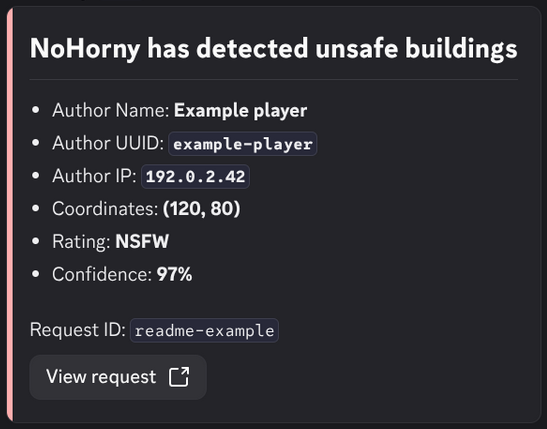

# NoHorny

<p align="center">
  
</p>

[](https://maven.xpdustry.com/#/releases/com/xpdustry/nohorny-client)
[](https://github.com/xpdustry/nohorny/releases)
[](https://github.com/Anuken/Mindustry/releases)
[](https://discord.xpdustry.com)

## Description

Are you sick of players turning your awesome Mindustry server into a NSFW gallery?
Do you wish to bring back your logic displays without the fear of seing anime girls in questionable positions?

Introducing **NoHorny**, your autonomous NSFW moderation plugin.
It can detect NSFW logic displays, canvases, sorter and illuminator pixel art, and ban the offending players.

Enjoy this family friendly factory building game as the [cat](https://github.com/Anuken) intended it to be.

## Client (Mindustry Plugin)

### Installation

This plugin requires at least:

- Mindustry 159
- Java 25
- [SLF4MD](https://github.com/xpdustry/slf4md) latest (optional)

Put [`nohorny-client.jar`](https://github.com/xpdustry/nohorny/releases/latest) in your `config/mods` directory and start your mindustry server.

Now, players placing unsafe buildings will be automatically banned.
Then the buildings will be deleted and refunded to the player's team.

### Configuration

You can configure NoHorny using the Mindustry built-in `config` command in your server console, with `config key value`.

#### Available settings

| Key                             | Description                                                                                                                                                               | Default Value                      |
|---------------------------------|---------------------------------------------------------------------------------------------------------------------------------------------------------------------------|------------------------------------|
| `nohorny-auto-mod-policy`       | The policy to apply when a group of buildings is classified.                                                                                                              | `BAN_NSFW`                         |
| `nohorny-api-endpoint`          | Base URL used by the plugin. The client resolves `status` and `classify` relative to it.                                                                                  | `https://nohorny.xpdustry.com/api` |
| `nohorny-api-auth-type`         | HTTP auth mode for the API. Valid values: `DISABLED`, `BASIC`, `BEARER`.                                                                                                  | `DISABLED`                         |
| `nohorny-api-auth-value`        | Auth payload. For `BASIC`, use `username:password`. For `BEARER`, use the raw token.                                                                                      | empty                              |
| `nohorny-discord-webhook`       | Discord webhook used to send alerts when unsafe buildings are detected.                                                                                                   | empty                              |
| `nohorny-discord-webhook-name`  | Username used for messages sent through the Discord webhook.                                                                                                              | `NoHorny`                          |
| `nohorny-discord-webhook-proxy` | Whether discord requests should be proxied. Useful if discord is banned in the host country of your servers. Uses [ProxyScrape](https://proxyscrape.com/free-proxy-list). | `false`                            |
| `nohorny-discord-webhook-image` | Whether discord alerts should upload the image of the unsafe buildings. Valid values: `AUTO`, `ALWAYS`, `NEVER`.                                                          | `AUTO`                             |
| `nohorny-debug-tap`             | Enables admin double-tap debugging for tracked displays, canvases, sorters and illuminators.                                                                              | `false`                            |

#### Auto-Mod Policies

| Policy        | Behavior                                        |
|---------------|-------------------------------------------------|
| `DISABLED`    | No action taken.                                |
| `DELETE_NSFW` | Delete buildings rated NSFW.                    |
| `DELETE_WARN` | Delete buildings rated WARN or NSFW.            |
| `BAN_NSFW`    | Ban the author and delete buildings rated NSFW. |

#### Discord Webhook

You can set up a discord webhook to be alerted when a NSFW building is detected.

Just configure the webhook url using `config nohorny-discord-webhook https://discord.com/api/webhooks/999999/abcdefgh`.



Checkout [MAD](https://github.com/phinner/mad) if you want to automatically delete the alerts.

When the NoHorny server exposes a web page for each request, the alert includes a "View request" button linking to it.
You can choose whether the image is also uploaded to discord with `config nohorny-discord-webhook-image <policy>`:

| Policy   | Behavior                                                                                                   |
|----------|------------------------------------------------------------------------------------------------------------|
| `AUTO`   | Link to the request page on the server instead of uploading the image, upload it only when no link exists. |
| `ALWAYS` | Always upload the image to discord, alongside the link when there is one.                                  |
| `NEVER`  | Never upload the image to discord.                                                                         |

> [!Note]
> 
> If discord is banned in your country, run `config nohorny-discord-webhook-proxy true`.
>
> NoHorny will try to find a suitable proxy to send the alerts from.

#### Debugging

Set `nohorny-debug-tap` to `true` to enable admin-only debugging. When enabled, double-tapping a tracked display,
canvas, sorter or illuminator group labels the detected group in-game, then creates a JPEG render and binary dump in `config/mods/nohorny/debug/`.

### Developing

You can integrate your plugin with the NoHorny client by just adding the following to your `build.gradle`:

```gradle
repositories {
    maven { url = uri("https://maven.xpdustry.com/releases") }
}

dependencies {
    compileOnly("com.xpdustry:nohorny-common:VERSION")
    compileOnly("com.xpdustry:nohorny-client:VERSION")
}
```

You will then be able to:

- Subscribe to [classifications events](nohorny-client/src/main/java/com/xpdustry/nohorny/client/ClassificationEvent.java) to handle unsafe buildings with your own logic:

```java
import arc.Events;
import mindustry.mod.Plugin;

public final class MyPlugin extends Plugin {

    @Override
    public void init() {
        Events.on(ClassificationEvent.class, event -> {
            System.out.println(
                    "The group at " + event.group().x() + ", " + event.group().y() + " has been classified");
        });
    }
}
```

- Programmatically configure NoHorny using its [setting system](nohorny-client/src/main/java/com/xpdustry/nohorny/client/NoHornySetting.java):

```java
import com.xpdustry.nohorny.client.AutoModeratorPolicy;
import com.xpdustry.nohorny.client.NoHornyClientAuthType;
import com.xpdustry.nohorny.client.NoHornySetting;
import java.net.URI;
import mindustry.mod.Plugin;

public final class MyPlugin extends Plugin {

    @Override
    public void init() {
        NoHornySetting.API_ENDPOINT.set(URI.create("https://localhost:8080"));
        NoHornySetting.API_AUTH_TYPE.set(NoHornyClientAuthType.BEARER);
        NoHornySetting.API_AUTH_VALUE.set("my-token");
        NoHornySetting.AUTOMOD_POLICY.set(AutoModeratorPolicy.DELETE_WARN);
    }
}
```

## Server

### Installation

This is a standalone Java application requiring:

- Java 25

Then, you can simply run `java -jar nohorny-server.jar`.

### Configuration

See [`nohorny-server/src/main/resources/application.yaml`](nohorny-server/src/main/resources/application.yaml).

Then, you can configure the server using:

- An `application.yaml` file

```yaml
# application.yaml
server:
  port: 9090
```

- Env variables

```text
SERVER_PORT=9090 java -jar nohorny-server.jar
```

- Or jvm properties

```text
java -Dserver.port=9090 -jar nohorny-server.jar
```

The SQLite database is stored at `nohorny.storage.database`, which defaults to `database.sqlite`, and the images
in the `nohorny.storage.images` directory, which defaults to `images`. Identical images share one file named by its hash.
The Docker image stores both under `/data`, mount the volume to keep them.

Set `nohorny.public-url` to the public address of the server, such as `https://nohorny.example.com`,
so the classification responses link to their request page.

### Pages

- `/` shows the live classification counters.
- `/requests/{id}` shows a single request, its image blurred until revealed, and lets anyone holding the link purge the image.
- `/privacy` explains what the plugin sends and what the server keeps, with the retention periods below.
- `/admin` lists the requests with filters and manages the users, for the administrators.

The frontend app prerenders the pages, see [Building](#building).
The JSON API used by the plugin and the pages lives under `/api`.

### Retention

Every classification is recorded on a best-effort basis: if recording fails, the verdict is still returned, without a
request page. The image is only stored when it is rated `WARN` or `NSFW`, or when the classification failed.
Images are deleted after `nohorny.requests.image-retention` (14 days), requests after `nohorny.requests.retention` (90 days).
The all-time counters are kept.

### Users and security

The classification API is rate limited under `nohorny.rate-limit`:

| Caller                                 | Default    | Shared by                | Setting                  |
|----------------------------------------|------------|--------------------------|--------------------------|
| Anonymous client                       | 5 / min    | its address              | `anonymous`              |
| Listed Mindustry server, no account    | 60 / min   | the servers of a network | `mindustry`              |
| User account, with HTTP Basic          | 120 / min  | all its addresses        | `user`, then per account |

Set `anonymous` or `mindustry` to `0` to require an account from those callers.
The limit of each account is changed from the admin panel, `user` is the one of the new accounts.
A limited request is answered `429 Too Many Requests` with a `Retry-After` header, which the plugin waits out.

The first administrator comes from the configuration, set its password to create it on startup:

```yaml
nohorny:
  security:
    admin:
      username: admin # the default
      password: ${NOHORNY_ADMIN_PASSWORD:}
```

Or set the `NOHORNY_SECURITY_ADMIN_PASSWORD` env variable, which needs no configuration file, such as with Docker.

On every startup, the bootstrap administrator is created if missing, and its password and role are restored
to the configured ones, so the configuration is always the way back in.
Its password can only be changed in the configuration.
Without a password, no bootstrap administrator is configured and a warning is logged.

Then sign in to `/admin` and open the "Users" view to create the other users, change their password or role, or delete them.
The admin role grants access to the admin page, the others can only authenticate to the classification API.
The bootstrap administrator and your own account cannot be demoted nor deleted.
The same operations are available from the JSON API, see the "Users" section of the API docs.

### Reverse proxy

Forward the whole host to the server, the pages and the API are served from the root.
Then enable the forwarded headers, so the rate limits and the Mindustry server detection see the original client address:

```yaml
server:
  forward-headers-strategy: framework
```

The proxy must overwrite, rather than append to, the `Forwarded` and `X-Forwarded-*` headers.
Leave this option set to `none` when the server is directly exposed.

## Building

- `./gradlew shadowJar` to compile all modules into jars at `nohorny-client/build/libs/nohorny-client.jar` and `nohorny-server/build/libs/nohorny-server.jar`.

- `./gradlew runMindustryServer` to run the client plugin in a local Mindustry server.

- `./gradlew :nohorny-native:cmakeBuild` to compile the native OpenCV classifier used by the server ViT classifier.
  It is optional and skipped if CMake is missing, but then the ViT classifier will be unavailable.
  It requires a C++20 compiler and the first build takes a while since it compiles a stripped down OpenCV.

- The pages of the server are the [`nohorny-frontend`](nohorny-frontend) app, in Solid 2 and Tailwind CSS, prerendered at build time.
  Building the server requires Node.js 22+ and [pnpm 12](https://pnpm.io). Gradle runs `pnpm install` and `pnpm build`,
  then bundles the result into the server jar. `./gradlew :nohorny-frontend:check` type checks and lints the app.
  To work on the pages, run a server on `127.0.0.1:8080` and `pnpm dev` in `nohorny-frontend`.
  The dev server proxies the API to that server. Set `NOHORNY_BACKEND` to use another address.

- `docker build .` to build the server image. It compiles the natives and builds the pages in their own stages.
  Pass `--build-arg PREBUILT_NATIVES=<dir>` to take the natives from a directory of the context instead, like CI does.

- `./gradlew spotlessApply` to apply the code formatting and the license header.

- `./gradlew :nohorny-client:jmh` to run the [benchmarks](nohorny-client/src/jmh/java/com/xpdustry/nohorny/client),
  use `-Pjmh="<args>"` to pass arguments to JMH, such as `-Pjmh="-p size=100 Tick"`.

## Releasing

Releases are immutable, their jars are attached before publishing:

1. Run the [Draft Release](https://github.com/xpdustry/nohorny/actions/workflows/draft-release.yaml) workflow on the commit to release.
   It creates a draft release pinned to that commit, with the jars attached and the commit list as notes.
2. Rewrite the notes, then publish the draft.
3. The published release triggers the Maven and Docker publishing, and bumps the version of `build.gradle.kts`.

## Performance

NoHorny renders and classifies the art on other threads, so the main loop only pays for keeping track of it.

We measured that cost on the hardware of the Xpdustry servers (Xeon E5-1650 v4, Java 25),
on the worst map we could make: entirely covered by canvases, logic displays, sorters and illuminators,
with players changing random pieces of art every tick.
The classifier also answers instantly, so NoHorny never gets to rest.

Mean main loop cost per tick, out of the 16ms a 60 TPS server has:

| Map                      | Art changes per tick | Without NoHorny | With NoHorny | NoHorny cost |
|--------------------------|---------------------:|----------------:|-------------:|-------------:|
| 100x100 (6k buildings)   |                    0 |           ~0 µs |      0.07 µs |     +0.04 µs |
| 250x250 (38k buildings)  |                    0 |           ~0 µs |      0.07 µs |     +0.04 µs |
| 500x500 (150k buildings) |                    0 |           ~0 µs |      0.06 µs |     +0.04 µs |
| 100x100                  |                   10 |          401 µs |       549 µs |      +148 µs |
| 250x250                  |                   10 |          421 µs |       681 µs |      +260 µs |
| 500x500                  |                   10 |          425 µs |       733 µs |      +308 µs |
| 100x100                  |                  100 |         4.05 ms |      4.58 ms |     +0.53 ms |
| 250x250                  |                  100 |         4.27 ms |      5.62 ms |     +1.35 ms |
| 500x500                  |                  100 |         4.36 ms |      5.41 ms |     +1.05 ms |

"Without NoHorny" is what Mindustry itself spends applying the art changes, to give a sense of scale.

- When the art sits still, NoHorny costs nothing measurable.
- At 10 changes per tick (600 per second), it costs at most 0.3ms, under 2% of a tick.
- At 100 changes per tick (6000 per second), it costs at most 1.35ms, under 9% of a tick.
- When a map loads, NoHorny scans it once, which takes 5ms, 33ms and 129ms for the three map sizes.

## Support

Need a helping hand? You can talk to the maintainers in [our discord server](https://discord.xpdustry.com)
in the `#support` channel.
